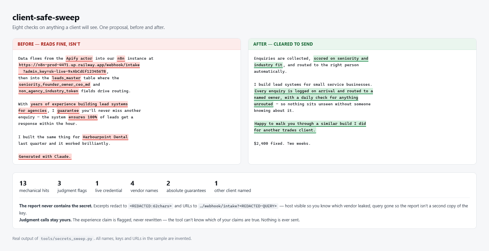

# client-safe-sweep

**A free Claude Code skill that checks anything a client will see, before you send it.**

One leaked internal column name, one "Generated with…" footer, one accidental guarantee in a
proposal — that's all it takes to look amateur or lose a deal.



## The eight checks

| # | Check | Catches |
|---|---|---|
| 1 | Secrets & infrastructure | `sk-` keys, tokens, webhook and instance URLs, base/table/workflow IDs |
| 2 | Internal plumbing | Pipeline column names, vendor names the client never bought, absolute paths |
| 3 | AI-authorship markers | Model names, "Generated with…", `Co-Authored-By` |
| 4 | Absolute guarantees | guarantee / 100% / always / ensures → reframed to controls |
| 5 | Experience overclaims | **Flagged for you, never auto-fixed** |
| 6 | Cross-client contamination | Another client's name or data, stale branding |
| 7 | De-jargon | `seniority_founder_owner_ceo_md` → "Founder-level title" |
| 8 | Platform mechanics | Character limits; pre-contract contact-info rules |

Applies to cover letters, proposals, quote messages, deliverable CSVs and docs, overviews, client
emails, demo video captions — anything client-visible. Not internal notes; sweeping those wastes a pass.

## Three design choices worth knowing

**Judgment calls stay yours.** Checks 4, 5 and 7 need eyes, not regex. Experience overclaims are
flagged and never rewritten — the skill cannot know which of your claims are true. It proposes;
you decide.

**A clean artifact gets an explicit CLEAN verdict**, not silence. Silence is indistinguishable from
a check that never ran.

**The report never contains the secret.** The bundled scanner redacts matched values before writing
anything to disk — excerpts become `<REDACTED:62chars>`, URL query strings become
`?<REDACTED-QUERY>` while the host stays visible so you still know which vendor leaked. A sweep
report containing the key has just moved the problem into a new file.

## Install

```
/plugin marketplace add aihunt-ttg/client-safe-sweep
/plugin install client-safe-sweep@client-safe-sweep
```

Then say "sweep this" before you send anything.

## Run the scanner directly

`tools/secrets_sweep.py` is stdlib-only, so it also works as a pre-send hook or CI step. It exits
non-zero when genuine hits remain:

```bash
python plugins/client-safe-sweep/skills/client-safe-sweep/tools/secrets_sweep.py ./outbound --out report.json
echo $?   # 1 = do not send yet
```

## See it work

[`examples/`](examples/) is a real run on a synthetic proposal — the draft, the actual scanner
output, the full verdict, and the cleared version. Reproduce it in one command.

## Who made this

I build automation and agent workflows for my own freelance practice. This skill exists because a
packaging pass once put internal pipeline column names into a client-facing CSV; the checklist is
what came out of that. It's the same sweep I run before my own work goes out.

If it catches something for you, that's the whole point — it's free and MIT licensed.

## Available for work

I take on freelance automation builds — agent workflows, n8n, Python, API integrations, and Claude
Code pipelines like this one. If you want a version of this tuned to your own stack, or you have
something else that needs automating: **ai-runnereatit@proton.me**

## License

MIT. See [LICENSE](LICENSE).
